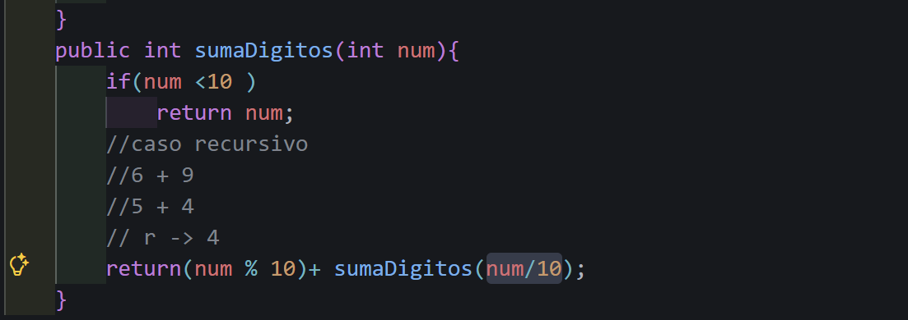

# Universidad Politecnica Salesiana

## Estructura de datos

## Estudiante: Kevin Morocho

## Practica Recursividad
### Fecha 11/05/2026
### Grupo: 3
### Descripción:

El tema de hoy aprendimos a usar la recursividad el cual es un método o función que se llama a sí mismo para resolver un problema dividiéndolo en subproblemas más pequeños.
